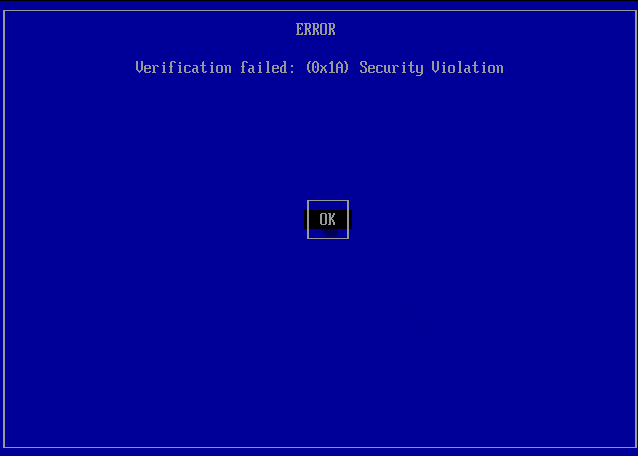

# Użycie Ventoy'a

Dla tych, którzy włączyli komputer - super, gratki. Jeżeli jednak tego nie zrobiłeś, to proszę zrób to i przeczytaj ten paragraf jeszcze raz. ;)

## Pomocy, mam niebieski ekran i jakiś chyba błąd
Jeżeli przy włączaniu widzisz taki ekran:

Nic się nie martw, to dzięki zabezpieczeniom Microsoft'a.

Jeżeli jednak nie widzisz czegoś takiego, możesz przejść do [następnego kroku](#na-co-w-sumie-patrze)

Używając entera i strzałek, zaznacz kolejne kroki:

## Na co w sumie patrze?