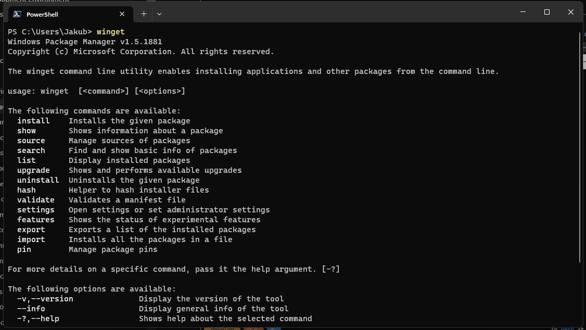

<!-- markdownlint-disable MD025 -->
# Ułatwiacze życia

## [winget](https://learn.microsoft.com/en-us/windows/package-manager/winget)

Moje ulubione narzędzie. Wyobraź sobie świat, gdzie wszystkie instalatory, biblioteki i programy można zdobyć w jednym miejscu bez potrzeby zapamiętywania linków. Właśnie od tego powstał program autorstwa Microsoft'u: `winget`. Wszystkie Windows'y 11 oraz nowsze Windows'y 10 mają go zainstalowanego, więc nic tak na prawdę nie musisz robić. Nie jest to jednak typowa aplikacja. Jest komendą do konsoli. (Sama konsola też jest domyślnie instalowana)


### Użycie

Szukamy jednego z programów:

- Terminal *(zalecane)*
- PowerShell

{: .note}
> Technicznie rzecz biorąc, Terminal uruchomi PowerShell'a, ale za to będzie o wiele ładniej wyglądać!

Użycie polega na tym:

`winget *polecenie* *argument/y*`

Na przykład:

- `winget search firefox` - komenda przeszukująca bazę programów o nazwie *Firefox*
- `winget install mozilla.firefox` - komenda pobierająca program o ID: `mozilla.firefox`
- `winget pin discord.discord` - powstrzymuje aktualizacje Discord'a
- `winget` - wszystkie pozostałe polecenia ;)

## Paczka programów

Dla chętnych, oto moja paczka programów:
[Pobierz](/winget.json)

{: .note }
> Listę programów które są na liście możemy sprawdzić wchodząc w ten plik i po prostu patrząc co jest na liście. Możemy usunąć też te niepotrzebne usuwając je **włącznie z nawiasami i przecinkiem na końcu**. Usuwamy coś takiego:

``` json
{
     "PackageIdentifier" : "twórca.program"
},
```

Aby jej użyć, pobieramy, włączamy konsolę i wpisujemy `winget import`, dajemy spację żeby oddzielić od pliku, i żeby nie musieć przepisywać lokalizacji pliku, możemy po prostu skopiować plik i wkleić go do konsoli. Pojawi się wtedy ścieszka do pliku. Na przykład:
`winget import C:/winget.json`

Klikamy enter i czekamy aż wszystko się ściągnie.

{: .note }
> Możesz tworzyć swoje własne paczki, możemy użyć komendy `winget export *ścieżka pliku*`. We wskazanym miejscu pojawi się plik z waszą paczką!

## [WingetUI](https://github.com/marticliment/WingetUI)

To samo co wyżej, tylko tak szczerze używalne. Auto aktualizacje, więcej źródeł domyślnych i tak szczerze ładny interfejs. Jest u mnie w paczce, ale jeżeli jej nie używasz, to zrobisz to komendą `winget install SomePythonThings.WingetUIStore`.
[Screenshot'y](https://github.com/marticliment/WingetUI#screenshots)

## Cała reszta

Nie jestem wielkim fanem instalowania tony programów. Dlatego więc całą resztę możesz dostosować do siebie.

{: .warning}
> Pamiętaj tylko, żeby ***NIE*** instalować żadnych programów typu:
>
> - Automatycznie instalujące sterowniki, np: *Driver booster*
> - Przyspieszacze i naprawiacze komputerów
> - Darmowe antywirusy

Jeżeli masz już wszystko, czego potrzebowałeś, zapraszam na [ostatnią stronę](goodbye).
