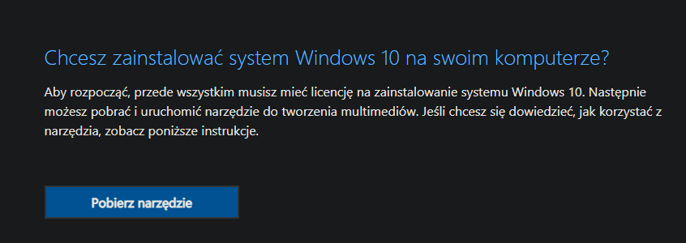
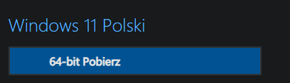

<!-- markdownlint-disable MD025 -->
# Vanilla

Bezpieczna, prosta ale też i czasami monotonna droga. Jak Pan Microsoft chciał by było. Chyba...

## Pobieranie

Proces cholernie prosty. Wchodzimy w ten link:

- Windows 10: <https://www.microsoft.com/pl-pl/software-download/windows10>
- Windows 11: <https://www.microsoft.com/pl-pl/software-download/windows11>

### Windows 10

Pobieramy narzędzie używając... *Pobierz narzędzie*. Nie kliknij tylko przez przypadek guzika *Zaktualizuj teraz*, bo to nam aktualnie kompletnie nie potrzebne.

Uruchamiamy je i ~~czytamy całą licencje oprogramowania~~ klikamy akceptuj.

Czekamy chwilkę...

I jeszcze jedną...

Gdy wreszcie łaskawie zostaniemy zapytani, co właściwie chcemy zrobić, wybieramy 2. opcję *Stwórz nośnik instalacyjny*. Czy coś w ten deseń.

Wybieramy język, zostawiamy jednak edycje oraz architekture (`x64`).

Po kliknięciu dalej, wybieramy 2. opcję, czyli *plik ISO*, wybieramy gdzie chcemy go pobrać (na przykład do dysku `Ventoy` jeżeli zależy nam na miejscu) i czekamy aż wszystko się pobierze. Polecam **porządnie** uzbroić się w cierpliwość.

Już? Super, idziemy [na koniec](#po-pobraniu).

### Windows 11

Tutaj będzie trochę łatwiej. Wchodzimy na wyżej podaną stronę, zjeżdżamy do jakże wygodnej części *Pobieranie obrazu dysku (ISO) systemu Windows 11* i wybieramy w polu *Wybierz Pobierz*, *Windows 11 (multi-edition ISO)*.

Teraz wybieramy język nowego systemu i zatwierdzamy.

Po chwili powinien pojawić się przycisk: *64-bit Pobierz*:

Cierpliwie czekamy aż się pobierze i przechodzimy [niżej](#po-pobraniu).

## Po pobraniu

Teraz możemy wrzucić plik na poprzednio utworzoną partycję `Ventoy`, jeżeli nie zrobiliśmy tego przy pobieraniu.

{: .info }
> To dobry moment, żeby zrobić kopię zapasową lub upewnić się, że wszystko zostało zabezpieczone a dla osób z potrzebą odzyskania plików z uszkodzonego systemu zachęcam do [pobrania Linux'a](../linux).

Gdy wszystko gotowe, możemy zacząć [instalację](../../install).
